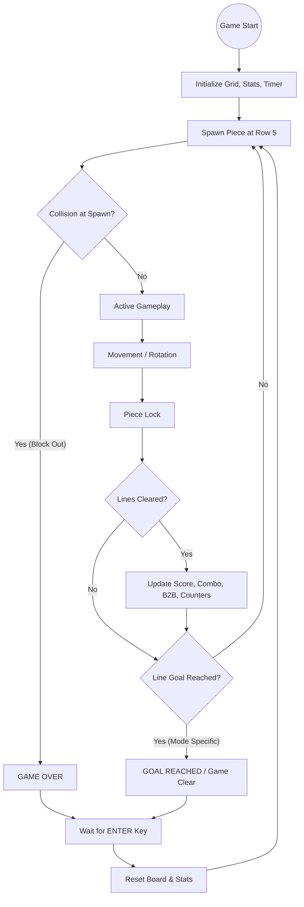

# Tetris Game Over Condition Diagrams

This document outlines the Game Over and Game Clear conditions implemented in the **lolits** Tetris engine.

## 1. Flow of Game State Transitions

The game transitions between states based on player performance and the rules of the selected mode.



---

## 2. Grid Structure and Spawning

The grid is expanded vertically to handle processing and buffer zones.

| Row Range | Status | Purpose |
| :--- | :--- | :--- |
| **0 - 4** | Hidden | Buffer zone for processing and high-speed maneuvers. |
| **5** | Partially Visible | **Spawning Row (21st Line)**. Pieces spawn with their bottom row here. |
| **6 - 25** | Visible | **Main Playfield (Lines 1 - 20)**. |

### Spawning Visual Representation
```text
[ Buffer Zone ]          Rows 0-4 (Processing Only)
------------------------
[ Partial Visibility ]   Row 5 (Spawn Point: Bottom of piece spawns here)
======================== (Screen Top)
[ Main Visible Field ]   Rows 6-25 (Standard Gameplay)
------------------------
```

---

## 3. Detailed Logic Definitions

### A. Block Out (Game Over)
A **Block Out** occurs immediately when a new piece is generated but overlaps with an existing block in the grid. In this implementation, the check is performed in `spawnPiece()` using the `collide()` method.

### B. Goal Reach (Game Clear)
In **Line Goal Modes** (40, 80, or 120 lines), the game checks the total line count after every line clear. If the count meets or exceeds the target, `gameOver` is set to `true`, a **Rank** is calculated based on `elapsedTime`, and the results overlay is displayed.

### C. Reset & Persistence
- **Enter Key:** Resets all in-memory variables (`grid`, `score`, `lines`, `counters`, `elapsedTime`).
- **Save/Load:** The serializable state (including `elapsedTime`, `lineGoal`, and `counters`) is exported to/imported from a JSON file.
